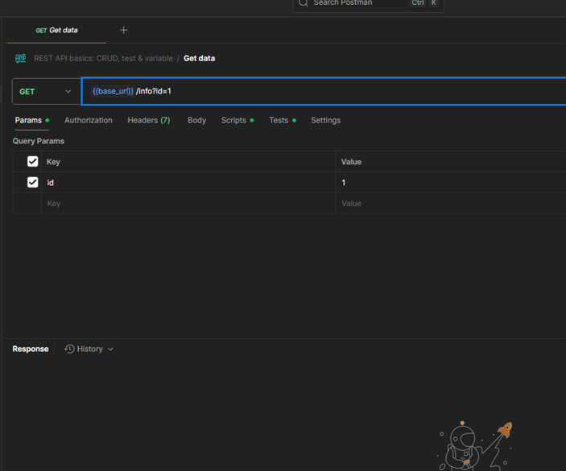

# Лабораторная работа №1 - Пользовательские запросы в веб-приложении (DevTools, HTTP, REST, JSON, Postman)
 
## 1. Теория

### 1.1. Что такое DevTools

**DevTools (Developer Tools)** — встроенные инструменты разработчика браузера (Chrome, Firefox, Edge, Safari).  
Открытие: **F12**.

Основные панели:

- **Elements** — DOM и визуальная структура страницы.  
- **Console** — ошибки, логи, выполнение JS.  
- **Network** — анализ запросов, коды, заголовки, время.  
- **Performance** — измерение скорости работы страницы.  
- **Device mode** — проверка адаптивности интерфейса.  
- **Security** — HTTPS, сертификаты.  
- **Memory** — утечки памяти и использование ресурсов.

**Пример интерфейса DevTools:**

{ loading=lazy }

---

### 1.2. Пользовательские запросы

Пользовательские запросы — это **HTTP-запросы** (GET, POST и др.), которые браузер отправляет при работе с веб-приложением.

Основные характеристики запроса:

- метод (GET/POST/PUT/DELETE/…)  
- URL и параметры  
- заголовки (headers)  
- тело запроса / ответа  
- время выполнения  
- код ответа  

**Оптимизация запросов:**

- уменьшение количества обращений;  
- сокращение объёма передаваемых данных;  
- кэширование;  
- пагинация и фильтрация;  
- использование правильных HTTP-методов и заголовков.

**Основные HTTP-методы**

| Метод  | CRUD   | Назначение              | Особенности                                  | Пример                |
|--------|--------|-------------------------|----------------------------------------------|-----------------------|
| GET    | Read   | Получение данных        | Параметры в URL, кэшируемый, не меняет данные | `/users?id=5`         |
| POST   | Create | Создание ресурса        | Данные в теле, изменяет состояние            | Регистрация, заказ    |
| PUT    | Update | Полное обновление       | Заменяет весь объект                         | Обновить профиль      |
| PATCH  | Update | Частичное обновление    | Меняет только указанные поля                 | Сменить только email  |
| DELETE | Delete | Удаление ресурса        | Обычно `200 OK` или `204 No Content`         | Удалить товар         |
| HEAD   | —      | Только заголовки        | Проверка наличия / размера / даты            | Проверка `Last-Modified` |
| OPTIONS| —      | Поддерживаемые методы   | Preflight (CORS)                             | Доступность POST/PUT  |

---

### 1.3. Коды ответов

- **1xx** — информационные (например, `100 Continue`).  
- **2xx** — успешные (`200 OK`, `201 Created`, `204 No Content`).  
- **3xx** — перенаправления (`301`, `302`, `304 Not Modified`).  
- **4xx** — ошибки клиента (`400`, `401`, `403`, `404`).  
- **5xx** — ошибки сервера (`500`, `502`, `503`, `504`).  

---

### 1.4. REST API

**REST** — архитектурный стиль взаимодействия с ресурсами по HTTP.

Принципы:

- клиент–сервер;  
- отсутствие состояния (stateless);  
- единообразный интерфейс;  
- работа с ресурсами (уникальные URL);  
- часто используется формат **JSON**.

---

### 1.5. JSON

**JSON** — лёгкий текстовый формат обмена данными (объекты, массивы, строки, числа, boolean, `null`).

Пример ответа:

```json
{
  "userId": 1,
  "id": 1,
  "title": "sunt aut facere...",
  "body": "quia et suscipit..."
}
```

---

### 1.6. Postman

**Postman** — инструмент для работы с API:

* создание и отправка запросов;
* анализ ответов;
* сохранение коллекций;
* автотесты;
* совместная работа.

{ loading=lazy }

---

## 2. Задание

### 2.1. Требуемые инструменты

* браузер (Chrome / Firefox / Edge / Яндекс.Браузер);
* DevTools → вкладка **Network** (режим Online, без ограничения скорости или с 4G-профилем).

{ loading=lazy }

---

### 2.2. Первичный анализ запросов

1. Откройте DevTools (**F12**) → вкладка **Network**.

2. Загрузите страницу:

   ```text
   https://jsonplaceholder.typicode.com/posts
   ```

3. Зафиксируйте в таблице: метод, URL, код ответа, размер данных, время загрузки.

4. Сделайте скриншот списка запросов.

{ loading=lazy }

---

### 2.3. Детальный разбор одного запроса

Выберите любой запрос и опишите:

* метод;
* URL и параметры;
* заголовки (Request Headers / Response Headers);
* тело ответа (Response / Preview);
* код ответа;
* время выполнения.

Сравните его с другим запросом и сделайте вывод.

{ loading=lazy }

---

### 2.4. Эксперименты с запросами

Выполните в консоли:

```js
fetch("https://jsonplaceholder.typicode.com/posts/1")
  .then(res => res.json())
  .then(data => console.log(data));
```

Проанализируйте запрос во вкладке **Network**.
Сравните:

* `GET /posts` (все посты);
* `GET /posts/1` (один пост).

Сделайте выводы по:

* размеру ответа;
* времени загрузки;
* количеству записей.

---

### 2.5. Работа с параметрами

1. Откройте в браузере:

   ```text
   https://jsonplaceholder.typicode.com/posts?userId=1
   ```

2. Сравните с `https://jsonplaceholder.typicode.com/posts`:

   * сколько объектов вернулось;
   * размер ответа;
   * время загрузки.

Сделайте вывод, как параметры помогают **уменьшить объём данных**.

---

### 2.6. Массовые запросы

Откройте несколько URL одновременно:

* `/posts/1`
* `/posts/2`
* `/posts/3`

Зафиксируйте:

* как меняется время отклика;
* как браузер параллелит запросы;
* нет ли избыточных запросов.

---

### 2.7. Заголовки и ответы

1. Во вкладке **Headers** выпишите не менее 5 ключевых заголовков, например:

   * `Content-Type`
   * `Cache-Control`
   * `ETag`
   * `Date`
   * `Server`

2. Сравните вкладки **Preview** и **Response**:

   * чем они отличаются по представлению данных;
   * в каких случаях удобнее использовать Preview, а в каких — Response.

---

### 2.8. Оптимизация запросов

Сравните ответы:

| Запрос            | Размер ответа | Время загрузки |
| ----------------- | ------------- | -------------- |
| `/posts`          | …             | …              |
| `/posts?userId=1` | …             | …              |
| `/posts/1`        | …             | …              |

**Предложите меры оптимизации:**

* пагинация (ограничение количества записей на страницу);
* фильтрация (по `userId`, статусам и т.п.);
* уменьшение размера ответа (убрать лишние поля);
* кэширование на клиенте и сервере;
* использование правильных заголовков (`Cache-Control`, `ETag` и т.д.).

---

### 2.9. Работа с API через Postman

1. Перейдите на сайт:

   ```text
   https://www.postman.com/
   ```

2. Выполните:

   * `GET /posts`
   * `GET /posts/1`

   Сравните ответы.

3. Выполните **POST** `/posts` с JSON-телом:

   ```json
   {
     "title": "Пост через Postman",
     "body": "Текст поста",
     "userId": 2
   }
   ```

4. Выполните:

   * **PUT** `/posts/1` — полное обновление ресурса;
   * **PATCH** `/posts/1` — частичное обновление (изменить только один-два поля).

   Объясните, чем отличаются результаты.

5. Выполните **DELETE** `/posts/1` и зафиксируйте:

   * код ответа;
   * тело ответа (если есть).

{ loading=lazy }

---

### 2.10. Сравнение DevTools и Postman

Сделайте таблицу или краткое сравнительное описание:

* **DevTools**

  * анализ реальных запросов страницы;
  * проверка производительности, кэширования;
  * работа в контексте открытого сайта.

* **Postman**

  * ручное конструирование запросов;
  * сохранение коллекций;
  * тесты и скрипты;
  * работа с авторизацией и токенами.

Сделайте вывод: **когда удобнее DevTools, а когда Postman**.

---

## 3. Контрольные вопросы

1. Что такое DevTools и какие задачи решают вкладки Elements, Console и Network?
2. Как открыть DevTools и какие настройки вкладки Network важны для замеров производительности?
3. Перечислите основные части HTTP-запроса (метод, URL/параметры, заголовки, тело) и их назначение.
4. Чем отличаются методы GET, POST, PUT, PATCH и DELETE? Приведите по одному практическому примеру.
5. Для чего используются методы HEAD и OPTIONS и где встречается preflight-запрос?
6. Расскажите о группах кодов ответов (1xx–5xx) и приведите примеры для 200, 301/302, 304, 404, 500.
7. Что такое REST и как ресурс в REST представлен на уровне URL?
8. Какие типы данных поддерживает JSON? Приведите короткий пример JSON-объекта и массива.
9. В чём отличие вкладок Preview и Response в карточке запроса DevTools?
10. Какие заголовки чаще всего анализируются при оптимизации (например, `Content-Type`, `Cache-Control`, `ETag`, `Authorization`)?
11. Какие приёмы снижения нагрузки на сеть можно использовать для API: пагинация, фильтрация, кэширование и др.?
12. Чем работа с API в Postman отличается от анализа запросов в DevTools, и когда уместен каждый инструмент?

---

## Чек-лист для самопроверки

| Баллы   | Критерии выполнения                                                                                                                                                                                                                                                                                                                                                                                                                                                                                                                                        |
| ------- | ---------------------------------------------------------------------------------------------------------------------------------------------------------------------------------------------------------------------------------------------------------------------------------------------------------------------------------------------------------------------------------------------------------------------------------------------------------------------------------------------------------------------------------------------------------- |
| **7**   | Выполнены **все пункты практики**:<br><br>– первичный анализ запросов (таблица + скриншоты);<br>– детальный разбор + сравнение запросов;<br>– работа с параметрами, массовые запросы, заголовки (5+);<br>– таблица оптимизации (`/posts`, `/posts?userId=1`, `/posts/1`);<br>– эксперименты в Postman (GET, POST, PUT, PATCH, DELETE);<br>– сравнение DevTools и Postman;<br>– все обязательные скриншоты (Network, Console, Postman);<br>– есть итоговые выводы и рекомендации;<br>– аккуратное оформление: таблицы, структурированные заголовки, выводы. |
| **6**   | Выполнена **полная практическая часть** в DevTools (таблицы, скриншоты, сравнения);<br>реализованы **все виды запросов в Postman**: GET, POST, PUT, PATCH, DELETE;<br>есть сравнение DevTools и Postman;<br>составлены рекомендации по оптимизации (5–7 мер);<br>оформление есть, но **структура слабее**: не всегда удачно выбраны заголовки, таблицы оформлены неаккуратно.                                                                                                                                                                              |
| **5**   | Выполнены основные шаги анализа запросов:<br>таблица с методами, URL, кодами ответа и временем;<br>есть сравнение `/posts` и `/posts/1`, работа с параметрами;<br>сделано 2–3 скриншота;<br>разобраны заголовки и показаны примеры запросов с параметрами;<br>примеры оптимизации приведены, но **не оформлены отдельной таблицей**;<br>в Postman реализованы только **GET/POST**.                                                                                                                                                                         |
| **3–4** | Краткое описание DevTools и HTTP-запросов;<br>выполнен **первичный анализ запросов** (таблица: метод, URL, код ответа, размер, время);<br>сделан **хотя бы один скриншот** из DevTools;<br>есть разбор одного запроса, но **без сравнений и выводов**;<br>JSON/REST API упомянуты, но **Postman не использован** или использован формально.                                                                                                                                                                                                                |
| **1–2** | Даны лишь **отдельные ответы** без общей структуры;<br>скриншоты отсутствуют или **не соответствуют заданию**;<br>теоретическая часть слабо раскрыта, практическая часть выполнена формально.                                                                                                                                                                                                                                                                                                                                                              |
| **0**   | Работа выполнена **с помощью ИИ** (автоматически сгенерированные ответы без личных скриншотов и анализа);<br>отсутствует выполнение практических шагов, присутствует только копипаст из методических материалов.                                                                                                                                                                                                                                                                                                                                           |

---

## Скачать шаблон отчёта


👉 **[Скачать шаблон отчёта](template//LR1.docx)**

